<!-- HEADER BANNER -->

 

---

## 👩‍💻 About Me

- 🎓 Computer Science undergraduate at the **University of Sri Jayewardenepura**
- 🤖 Interested in **AI** and ⚙️ **DevOps**
- 🌐 Building clean, responsive **web applications**
- 🌱 Currently learning: *( AWS , Docker, CI/CD, Machine Learning)*
  

---

## 🛠️ Tech Stack

**Languages**

**Frameworks & Tools**

---

## 📌 Featured Projects

| Project | Description | Tech |
|---|---|---|
| [**Portfolio**](https://github.com/hiru-ui/Portfolio) | My personal portfolio website |  |
| [**3D-Ship**](https://github.com/hiru-ui/3D-Ship) | 3D Ship Model and Simulation  | *(C++ , OpenGL , GLUT )* |
| [**Glamour-Cosmetics-Platform**](https://github.com/hiru-ui/Glamour-Cosmetics-Platform) | E-commerce website | *(HTML ,CSS ,Java, JS )* |

---

## 📊 GitHub Stats

---

## 📫 Let's Connect

 

*⭐ Thanks for stopping by!*

